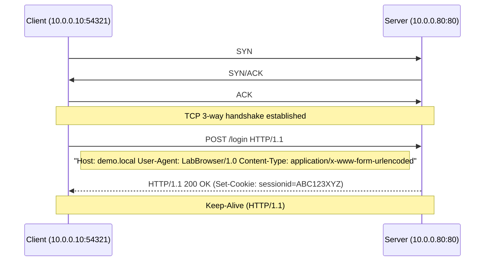

```mermaid
sequenceDiagram
  participant C as Client (10.0.0.10:54321)
  participant S as Server (10.0.0.80:80)

  C->>S: SYN
  S->>C: SYN/ACK
  C->>S: ACK
Note over C,S: TCP 3-way handshake established

  C->>S: POST /login HTTP/1.1
Note right of C: "Host: demo.local User-Agent: LabBrowser/1.0 Content-Type: application/x-www-form-urlencoded"
  S-->>C: HTTP/1.1 200 OK (Set-Cookie: sessionid=ABC123XYZ)

  Note over C,S: Keep-Alive (HTTP/1.1)
```
