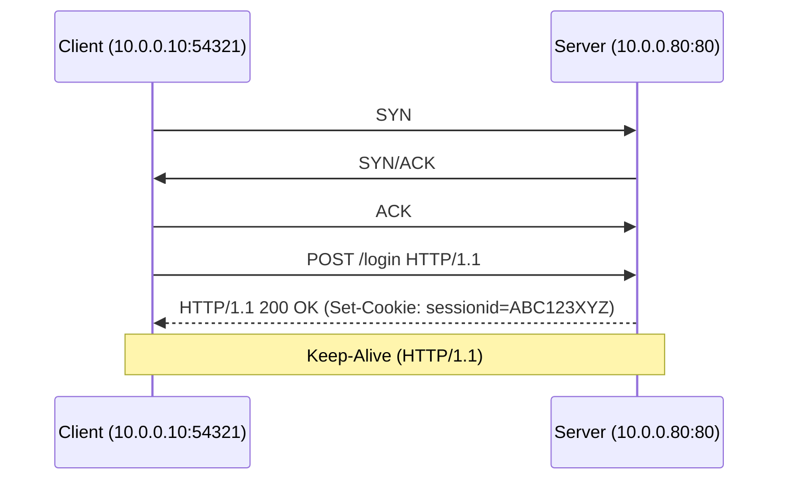

```mermaid
sequenceDiagram
  participant C as Client (10.0.0.10:54321)
  participant S as Server (10.0.0.80:80)

  C->>S: SYN
  S->>C: SYN/ACK
  C->>S: ACK

  C->>S: POST /login HTTP/1.1
  S-->>C: HTTP/1.1 200 OK (Set-Cookie: sessionid=ABC123XYZ)

  Note over C,S: Keep-Alive (HTTP/1.1)
```
