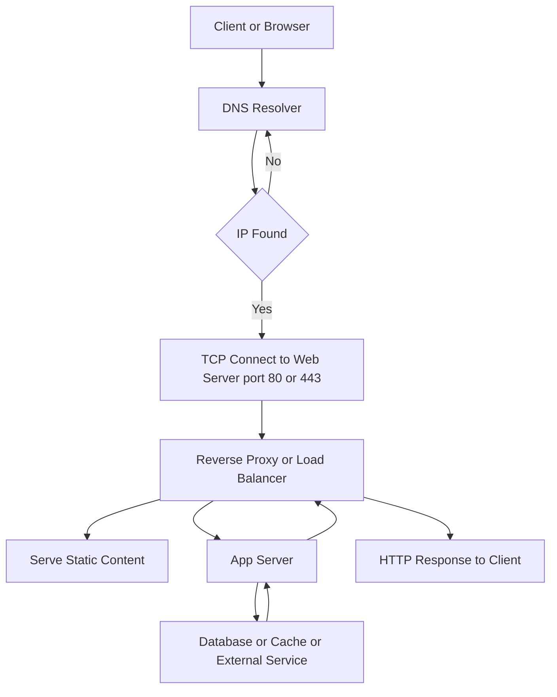

```mermaid
flowchart TD
  A[Client or Browser] --> B[DNS Resolver]
  B --> C{IP Found}
  C -->|Yes| D[TCP Connect to Web Server port 80 or 443]
  C -->|No| B
  D --> E[Reverse Proxy or Load Balancer]
  E --> F[Serve Static Content]
  E --> G[App Server]
  G --> H[Database or Cache or External Service]
  H --> G
  G --> E
  E --> I[HTTP Response to Client]

```
